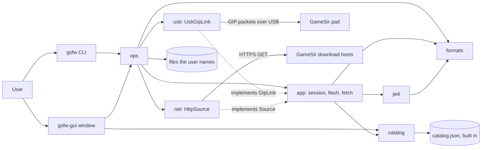

# Architecture Overview

`gsfw` is a community tool for GameSir controller firmware on JieLi AC695X chips. With it, a user
on macOS, Linux or Windows gets the firmware that a pad needs (also older versions that GameSir
does not offer), flashes it to recover a pad, and decodes firmware and chip files for research.
It is one Rust workspace: a core library, a CLI and an egui window. The CLI and the window run
the same operations of the core. Each command is one process against one pad. The project's own
code, docs and catalog are under The Unlicense. The repository contains no firmware.

## 1. Project Structure

```text
gamesir-firmware/                  # repository root
├── crates/
│   ├── gsfw-core/                 # library: everything except argument parsing and the window
│   │   ├── src/bytes.rs           # little-endian reads and writes
│   │   ├── src/formats/           # UFW and .fw containers, chip key, app decrypt, Nexus and Flash Tool carving
│   │   ├── src/jieli/             # JieLi GIP upgrade protocol: packets, fragments, flash head, flash plan (pure)
│   │   ├── src/catalog.rs         # parses the built-in firmware catalog
│   │   ├── catalog/catalog.json   # downloads that fetch knows, with SHA-256 sums (no firmware bytes)
│   │   ├── src/app/               # use cases: session, flash, fetch; owns the GipLink and Source ports
│   │   ├── src/usb.rs             # GipLink over USB (nusb), device list
│   │   ├── src/net.rs             # Source over HTTPS (ureq, rustls)
│   │   ├── src/ops.rs             # Op, PadAction, run: the operations both front ends offer
│   │   └── tests/                 # integration tests: pad simulator, G7 SE images, ops, HTTP
│   ├── gsfw/                      # CLI binary: hand-written argument parser to an Op
│   └── gsfw-gui/                  # egui window: a form to an Op, and the write confirmation
├── docs/                          # user docs: the JieLi GIP upgrade protocol and the recovery
├── tools/
│   └── check_no_firmware.py       # fails on a firmware image or a file over 1 MB in the tree
├── .github/workflows/check.yml    # CI on Linux, macOS and Windows
├── .clippy-test/                  # clippy configuration for the test lint lane
├── Cargo.toml                     # workspace, forbid-level lints, release profile
├── deny.toml                      # cargo-deny policy (licenses, advisories, sources)
├── rust-toolchain.toml            # pinned toolchain
├── justfile                       # the gate and the other commands in section 8
├── AGENTS.md                      # rules for coding agents (CLAUDE.md, GEMINI.md link to it)
└── ARCHITECTURE.md                # this document
```

Vendor binaries, firmware images and captures are never in the repository. `.gitignore` and
`tools/check_no_firmware.py` keep them out.

## 2. High-Level System Diagram



`bytes` is left out of the diagram. Every module below `ops` can use it.

## 3. Core Components

### 3.1. `gsfw-core` `formats`

`crates/gsfw-core/src/formats/`. Pure decoders. `ufw.rs` reads the UFW and `.fw` containers
(`Ufw`, `Ufw::entry`, `Info`) and the chip key. `cipher.rs` holds the CRC-16 and the app-image
cipher. `nexus.rs` carves the embedded images out of `HJC.GameSir.Nexus2_0.dll`. `flashtool.rs`
carves the files out of a GameSir Flash Tool `.exe` (a zlib archive in the PE overlay), and
`flashtool::target` refuses any stored name that is not a plain relative path. Errors are
`FormatError`. The module does no USB and no network.

### 3.2. `gsfw-core` `jieli`

`crates/gsfw-core/src/jieli/`. The JieLi GIP upgrade protocol as pure functions. `packet.rs`
builds and scrambles the 512-byte packets. `commands.rs` builds the C0 to C5 command bodies and
parses their replies. `gip.rs` splits a packet into GIP fragments and builds the fragment
acknowledgement. `flash_head.rs` reads the flash dir head. `plan.rs` (`plan_flash`, `erase_steps`,
`write_chunks`) turns an image and the pad's head into a `FlashPlan`, and refuses a layout,
EOFFSET or mode that does not fit. Errors are `ProtocolError`.

### 3.3. `gsfw-core` `catalog`

`crates/gsfw-core/src/catalog.rs`. Parses `crates/gsfw-core/catalog/catalog.json`, which the build puts into the
program. Each `Artifact` has an id, model, version, file name, size, SHA-256, publisher URLs,
mirror URLs, and the path and SHA-256 of each image in it. The parser refuses two artifacts with
one id, a file name that is not a plain name, and a bad SHA-256.

### 3.4. `gsfw-core` `app`

`crates/gsfw-core/src/app/`. The use cases, written against two ports that `app` owns:

- `GipLink` (`session.rs`): `send`, `reply`, `drain`. `open_session` runs C0 and C1 and gives a
  `Session`. `request` sends one command and skips stale replies by their tag. `device_crc` asks
  the pad for the CRC of a flash range (C5).
- `flash.rs`: `flash` chooses the image entry that fits the pad (`choose_plan`), compares region A
  and the target bank with the pad, and, only when asked to write, writes region C, zeroes the
  running bank's dir head, and asks for the result (C2).
- `Source` (`fetch.rs`): `get(url, limit)`. `fetch` tries each publisher URL, then each mirror URL,
  and uses the first body whose SHA-256 is the catalog's. A file that the user gives skips the
  port. It writes the artifact and its carved files into the output directory, and checks each
  image against its catalog SHA-256.

### 3.5. `gsfw-core` `usb` and `net`

`crates/gsfw-core/src/usb.rs`: `UsbGipLink` implements `GipLink` over `nusb` (no libusb).
`list_devices` lists the USB devices with the GameSir vendor ID and marks their GIP interfaces. `crates/gsfw-core/src/net.rs`: `HttpSource` implements `Source`
with `ureq` and `rustls`, and stops a body at the limit.

### 3.6. `gsfw-core` `ops`

`crates/gsfw-core/src/ops.rs`. `Op` names each operation (catalog, fetch, info, extract, app
image, USB match search, Nexus and Flash Tool extract, dry run, list, and the pad actions probe,
CRC and flash). `run` runs one `Op` and writes its output lines to a sink. It is the only place
that joins the use cases to the USB and HTTP adapters.

### 3.7. `gsfw` CLI

`crates/gsfw/src/cli.rs`. Parses the arguments by hand into an `Op`, then prints the lines of
`ops::run`. It does not use `clap`: its derive emits `#[allow]`, which the `forbid` lints refuse,
and its builder is over the stack-frame limit.

### 3.8. `gsfw-gui` window

`crates/gsfw-gui/src/app.rs` and `crates/gsfw-gui/src/app/form.rs`. An `eframe` window (glow backend). The form turns
the fields into the same `Op` that the CLI command gives, and a side panel lists each operation.
A flash that writes opens a dialog that names the image and the pad's product ID, and runs only
after the user confirms.

## 4. Data Stores

None: no database and no cache. The firmware catalog is a JSON file in the source tree that the
build puts into the program (`include_str!` in `catalog.rs`). It changes only by a change to the
repository. Operations read the files that the user names and write only into the output
directory that the user names.

## 5. External Integrations / APIs

- **GameSir download hosts.** `fetch` gets Flash Tool `.exe` files over HTTPS from the catalog
  URLs (`HttpSource` in `net.rs`), with the system's root certificates (`rustls-native-certs`).
  No mirror URL is in the catalog yet. One artifact has no URL and needs `--from FILE`.
- **GameSir pads over USB.** `UsbGipLink` in `usb.rs` talks the JieLi GIP upgrade protocol to a
  pad in Xbox (GIP) mode. On Windows the GIP interface must be bound to WinUSB (Zadig). On Linux
  the user needs a udev rule for vendor `3537` (`docs/jieli-gip-protocol.md`, no rule file in the
  repository).
- **GameSir Nexus and Flash Tool files.** `formats::nexus` and `formats::flashtool` read vendor
  files that the user already has. They are not network sources.

## 6. Deployment & Infrastructure

Not evident from the repository: no release workflow, installer or published package (each
`Cargo.toml` sets `publish = false`). Users build with `cargo run --release -p gsfw` or
`-p gsfw-gui`. `Cargo.toml` sets the release profile (`panic = "abort"`, overflow checks on).

CI is `.github/workflows/check.yml`. On `ubuntu-latest`, `macos-latest` and `windows-latest` it
runs `tools/check_no_firmware.py` and the cargo commands of `just host`. Only `ubuntu-latest` also
runs `cargo-deny`. The repository has no git
remote, so CI has not run.

## 7. Security Considerations

- Downloads and given files: `fetch` uses a body only when its SHA-256 is the catalog's, and each
  carved image must have its catalog SHA-256 (`app::fetch`). A download stops at the catalog size.
- Paths: the catalog refuses an artifact file name that is not a plain name (`catalog.rs`), and
  `flashtool::target` refuses a carved or image name with an empty, `.`, `..` or drive part, so no
  write leaves the output directory.
- Flash safety lives in `jieli` planning and `app::flash`, not in a front end: `plan_flash`
  refuses a layout, EOFFSET or mode that does not fit. Region C goes to the bank that the pad is
  not running and is written before the running bank's head is zeroed. Region A is never written:
  when it differs, `flash` stops unless the user keeps it (`--keep-region-a`).
- Writing needs an explicit choice. The default is checks only. The CLI needs `--yes`, and the
  window needs the write checkbox and then the confirmation dialog.
- Dependencies: `deny.toml` (run by the gate) checks licenses, advisories and sources. TLS is
  `rustls` with `ring`.
- No authentication exists or is needed: the tool is local, and the pad's upgrade session key
  comes from the pad (C0).
- Firmware is copyrighted by GameSir. `tools/check_no_firmware.py` keeps it out of the tree.

## 8. Development & Testing Environment

Rust 1.98.1 (`rust-toolchain.toml`), `just`, Python 3 for `tools/check_no_firmware.py`, and
`cargo-deny` 0.20.2 on `PATH` for the full gate. All lints are `forbid` in `Cargo.toml`. Clippy
reads `clippy.toml` for the code and `.clippy-test/clippy.toml` for the tests. From the
repository root:

```sh
just check
python3 tools/check_no_firmware.py
cargo run -q -p gsfw -- --help
```

`just check` formats, then runs clippy, the tests, the docs, a release build,
`tools/check_no_firmware.py` and `cargo-deny`. `just lint` is the fast lane during edits, and is
not acceptance. The tests need no firmware image: the simulator tests build their image in
the test.

### Quality scenarios

| # | Scenario | Measure | Check |
| --- | --- | --- | --- |
| Q1 | The USB link drops at any packet during `flash`. | The pad keeps one bank with an intact dir head: the old bank until region C is verified, the new one after. | Pad simulator in `crates/gsfw-core/tests/sim_flash.rs`: a guard checks the pad before each C3 and C4. `a_link_drop_is_reported` drops the link at spaced points and at the last calls, and expects an error each time. |
| Q2 | The image's layout, chip key or region A does not fit the pad. | No C3 or C4 packet is sent. | `region_a_mismatch_stops_before_writing`, and the `plan` unit tests (`rejections_in_order`). |
| Q3 | A downloaded or given artifact differs from the catalog. | It is never written or used. | `a_tampered_download_is_never_used`, `a_given_file_is_checked_and_no_url_is_asked`, `each_image_must_have_its_catalog_sha256`. |
| Q4 | Someone adds a firmware image to the repository. | CI fails. | `tools/check_no_firmware.py`: files that git tracks or does not ignore, `*.ufw`, `*.fw`, `*.bin`, or over 1 MB. |
| Q5 | The same core runs on macOS, Linux and Windows. | The unit and simulator tests pass on all three. | The CI matrix. Not run yet: no remote. |
| Q6 | A new model is added. | Only a catalog entry and a test change, unless the protocol differs. | Review. `the_builtin_catalog_is_valid` checks the built-in catalog. |

### Invariants

The module order inside `gsfw-core` is `bytes`, `formats`, `jieli`, `catalog`, `app`, then `usb`
and `net`, then `ops`. A module uses only modules before it (`catalog` uses only `formats`).
Cargo keeps the crate direction: `gsfw` and `gsfw-gui` depend on `gsfw-core`, so the core cannot
depend on them. These rules keep the rest:

- `formats` and `jieli` do not use `app`, `catalog`, `net`, `ops` or `usb`.
- `catalog` does not use `app`, `jieli`, `net`, `ops` or `usb`.
- `app` does not use its adapters (`usb`, `net`) or `ops`.
- Only `usb.rs` uses `nusb`. Only `net.rs` uses `ureq`, `rustls` and `rustls_native_certs`.
- The front ends reach the core through `ops`, the catalog list and the `GIP_FLAGS` default. They
  do not use `app`, `bytes`, `formats`, `net` or `usb`.

Code writes a path to another module as `crate::`, not as `super::super::`. A `super::` path
stays in its module. Each command below finds no match, and fails when a rule is broken:

```sh
! rg -n 'crate::(app|catalog|net|ops|usb)\b' crates/gsfw-core/src/formats crates/gsfw-core/src/jieli
! rg -n 'crate::(app|jieli|net|ops|usb)\b' crates/gsfw-core/src/catalog.rs
! rg -n 'crate::(net|ops|usb)\b' crates/gsfw-core/src/app
! rg -n '\bnusb::' crates -g '*.rs' -g '!crates/gsfw-core/src/usb.rs'
! rg -n '\b(ureq|rustls|rustls_native_certs)::' crates -g '*.rs' -g '!crates/gsfw-core/src/net.rs'
! rg -n 'gsfw_core::(app|bytes|formats|net|usb)\b' crates/gsfw/src crates/gsfw-gui/src
```

The commands do not see a grouped import (`use crate::{app, usb}`). The code has none. The gate
does not run these commands.

## 9. Future Considerations / Roadmap

Documented plans (owner, in the earlier version of this document and in `AGENTS.md`):

- A community mirror for artifacts that GameSir removes, in a separate repository or store. The
  owner adds the mirror URLs to the catalog. A takedown request is honoured.
- A Nexus package as a catalog artifact. This needs a `kind` field and the Nexus carve step in
  `fetch`.
- Per-mode VID and PID, the chip, and `verified` runs in the catalog, and a `flash` warning for a
  model and version with no `verified` run.
- Region A writes (the DLL's B/A path) only after they pass Q1 on the simulator.
- The research goals in `AGENTS.md`: talk to the vendor HID collection on macOS, a mode switch
  without the button combo, and a disassembler module for the AC695X.

Risks:

- A pad must enumerate with the GIP interface. On macOS, 6.64 came up only as HID `1082`, so the
  first recovery needed Windows. On 6.40, `gsfw probe` and `gsfw crc` worked on macOS.
  Nobody ran `flash` on macOS or Linux.
- Only the G7 SE is proven. Models with other erase units or EOFFSET 0x10 use plan paths that no
  live run has checked.
- C1 needs the chip key of the `_Key` image. No pad that needs `_No_Key` has been seen.
- `UsbGipLink` has no automated test. The simulator and the `session` tests use test doubles of
  `GipLink`.

Recommendations, not documented plans:

- Record the flash duration from the next live run. The 6.40 log has no timings.

## 10. Project Identification

- Project name: gamesir-fw (`gsfw`)
- Repository URL: Not evident from the repository (no git remote).
- Primary contact: Not evident from the repository (the crates list "gamesir-fw contributors").
- License: The Unlicense (`LICENSE`).
- Date of last update: 2026-09-29

## 11. Glossary / Acronyms

- GIP: Gaming Input Protocol, the Xbox USB protocol. The pad accepts the JieLi upgrade commands
  inside GIP messages.
- JieLi: the maker of the AC695X chip in the pads, and of `JL_Upgrade_Gip.dll`.
- UFW: the firmware container in GameSir Nexus. `.fw` is the container in a Flash Tool.
- Nexus: GameSir's Windows app (`HJC.GameSir.Nexus2_0.dll` holds the current images).
- Flash Tool: a per-model GameSir `.exe` that holds older images in a zlib archive.
- Artifact: one catalog download, with the images it holds.
- C0 to C5: the upgrade commands (session, chip key, result, erase, write, CRC).
- Region A: the boot area at flash address 0. Region C: the app bank that `flash` writes.
- Dir head: the header of a flash bank. The pad boots the bank whose head is intact.
- EOFFSET: the image field that selects the bank layout.
- Chip key: the key in the image that C1 sends. `_Key` and `_No_Key` images differ in it.

## 12. Architectural Decisions

### D1. A core library, a CLI and an egui window over the same operations

The owner chose Rust with a strict lint policy (the xsyetopz rust-template), one binary per OS, and
a CLI and a GUI that offer the same things. The first port was Python with `pyusb`, and needed
Python and libusb on each host. `nusb` replaces `rusb` because `rusb` links libusb. Consequence:
Windows users bind WinUSB with Zadig, Linux users need a udev rule, and the window needs X11 or
Wayland libraries on Linux.

### D2. One process, modules and two ports

A user runs one command against one pad, and nothing outlives the process, so there is no service
and no queue. `GipLink` and `Source` are the only ports. Nexus and Flash Tool carving are
`formats` functions on a fetched or given file, not sources. A port per model was rejected: every
model seen so far uses the same JieLi protocol, and a difference goes into the catalog until a
second protocol exists. A firmware web service was rejected: it has no deployment need and would
host the images.

### D3. The catalog is data, changed by review

`catalog.json` is the single source of the downloads. Only a change to the repository writes it.
All artifacts are Flash Tool `.exe` files today.

### D4. Fetch from GameSir first, a community mirror second (owner, 2026-09-29)

The images are GameSir's copyrighted binaries, and the Unlicense covers only the project's own
work. Recovery needs older images, which exist only in Flash Tools that can disappear. So `fetch`
takes the publisher's copy first, a mirror copy second, and a file the user gives. The catalog
SHA-256 proves each copy. The mirror is not in the tool repository, so a takedown of the mirror
does not remove the tool.

### D5. Flash safety rules live in `jieli` and `app`, not in a front end

The rules in section 7 are in `plan_flash` and `app::flash`. Rewriting region A on a mismatch, as
the DLL does, was rejected: the proven recovery does not need it, and a failure there can leave
no bootable bank.
